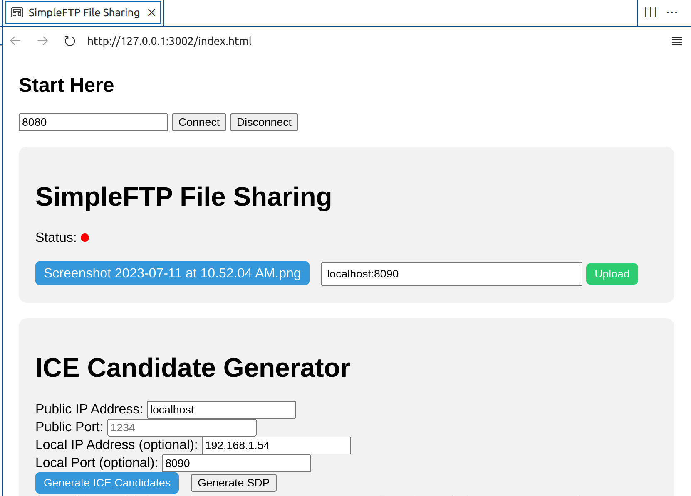
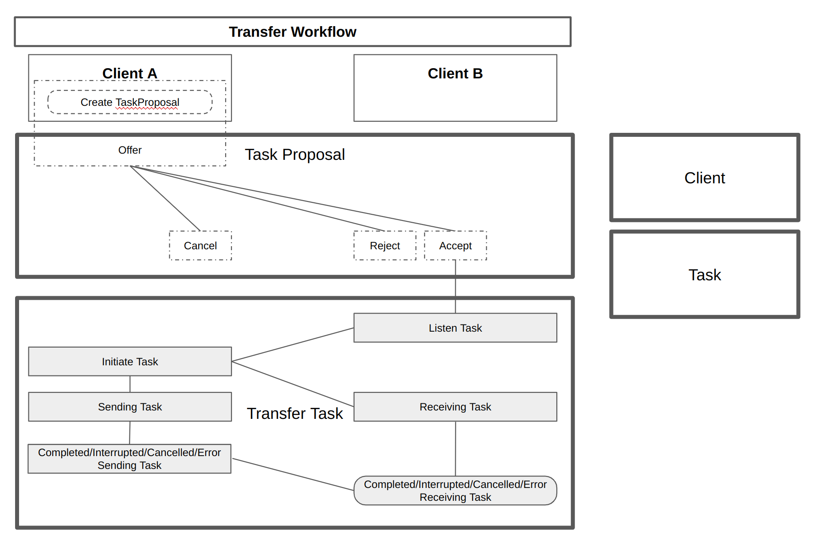
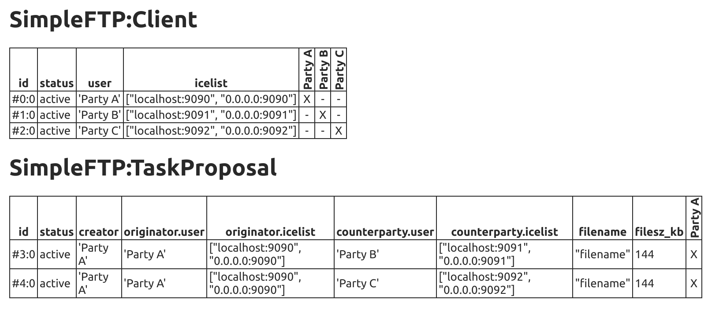

# SimpleFTP
## Canton Ledger Facilitated File Transfer

### What it does
- Uses a Canton ledger to broker a WebRTC connection from one client to another
- Uses that connection to send a file

### What it does not do
- Peer Discovery
    + TODO: Verify, this appears to be a limitation of either the DAML language or the Canton runtime

    + Why? 

        ChatGPT Explains:

            Unfortunately, it is not possible to achieve dynamic discovery 
            of parties in DAML. The query function expects a specific party
            as an argument to determine the visibility of contracts. You 
            cannot dynamically retrieve contracts across all parties without 
            explicitly specifying them.

            If you need to discover parties dynamically, you may consider 
            an alternative approach such as maintaining a separate registry 
            or creating an additional contract that keeps track of the 
            parties participating in the network.

### Participant Nodes Context Diagram

### SimpleFTP.daml

- `data TaskResult_ENUM`
    - Data class enumerating possible SimpleFTP TransferTask outcomes
    - i.e. 
        - `Complete`
        - `NotComplete`
        - `Finalizing`
        - `Rejected`
        - `Cancelled`
        - `Error`
- `template Client`
    - `DAML Template` containing choices necessary to create and accept file transfers
- `template TaskProposal`
    - `DAML Template` containing choices necessary to propose and allow the counterparty to either accept or reject the transfer
- `template TransferTask`
    - `DAML Template` containing choices necessary to complete a file transfer
- `setup` script
    - Demonstrates creation and brokering of the SimpleFTP `TransferTask`

## On-Deck Tasks
<!-- 
* Move Zap logic (early ICE discovery) to Client classes
* Set Up DataChannel listeners 
-->
* Send/Receive Text
* Make gRPC connectors

## Version History

* (Version NEXT)
    - [2023-07-11]
        - Initial check-in
        - Setup script simulates happy path file transfer
    - [2023-07-14]
        - Implementing Rubrik Requirements

    - [Not Implemented] Test Reject a task proposal
    - [Not Implemented] Test Finalizing (i.e. NotifyReceivingComplete seen before NotifySendingComplete)
    - [Not Implemented] Test Interrupted
    - [Not Implemented] Test Cancelled
    - [Not Implemented] Test Error
    - [Not Implemented] Test Simultaneous Task Proposals are allowed
    - [Not Implemented] Test accepting more than one Task Proposals is not allowed
    - [Not Implemented] Test accepting Task Proposal is not allowed while TransferTask is active
    - [Not Implemented] Test accepting Task Proposal is not allowed while TransferTask is active
    
### License

(c) Digital Asset 2023 - All Rights Reserved